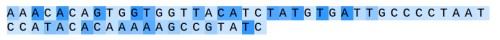

# char-dna

## Usage

### use pretrained model to predict plasmid probability

precalculated model was trained on 500 randomly selected full plasmid sequences (NCBI 2015 dump) on a Tesla K80 with RNN size 800 and sequence length of 150. Using this model you can predict the sequence similarity to the trained model using the `check.lua` script. This will ourput a .json formatted file of the probability for every character in your sequences. Because the model was trained on plasmid sequences only, this should give you a per-nucleotide probability that the input sequences follows the structure of the trained plasmid sequences. 

get the [lastest precalculated model](https://www.dropbox.com/s/rudzw859qxcl4wq/model.t7?dl=1)

```bash
th check.lua model.t7 -sequence "AAACACAGTGGTGGTTACATCTATGTGATTGCCCCTAATCCATACACAAAAAGCCGTATC" > sequence.json
```

to visualize the results, open `index.html` 



to get the overall probability of the input sequence you can use

```bash
th check.lua model.t7 -sequence "AAACACAGTGGTGGTTACATCTATGTGATTGCCCCTAATCCATACACAAAAAGCCGTATC" -overall 1 -log 1
> Mean sample log probability: -3.351086258032	
```

## installation

This code is written in Lua and requires [Torch](http://torch.ch/). If you're on Ubuntu, installing Torch in your home directory may look something like: 

```bash
curl -s https://raw.githubusercontent.com/torch/ezinstall/master/install-deps | bash
git clone https://github.com/torch/distro.git ~/torch --recursive
cd ~/torch; 
./install.sh      # and enter "yes" at the end to modify your bashrc
source ~/.bashrc
```

See the Torch installation documentation for more details. After Torch is installed we need to get a few more packages using [LuaRocks](https://luarocks.org/) (which already came with the Torch install). In particular:

```bash
luarocks install nngraph 
luarocks install optim
luarocks install nn
luarocks install json
```

If you'd like to train on an NVIDIA GPU using CUDA (this can be to about 15x faster), you'll of course need the GPU, and you will have to install the [CUDA Toolkit](https://developer.nvidia.com/cuda-toolkit). Then get the `cutorch` and `cunn` packages:

```bash
luarocks install cutorch
luarocks install cunn
```

If you'd like to use OpenCL GPU instead (e.g. ATI cards), you will instead need to install the `cltorch` and `clnn` packages, and then use the option `-opencl 1` during training ([cltorch issues](https://github.com/hughperkins/cltorch/issues)):

```bash
luarocks install cltorch
luarocks install clnn
```


## Acknowledgements

Implementation based by karpathy. This code was originally based on Oxford University Machine Learning class [practical 6](https://github.com/oxford-cs-ml-2015/practical6), which is in turn based on [learning to execute](https://github.com/wojciechz/learning_to_execute) code from Wojciech Zaremba. Chunks of it were also developed in collaboration with my labmate [Justin Johnson](http://cs.stanford.edu/people/jcjohns/).

## License

MIT
